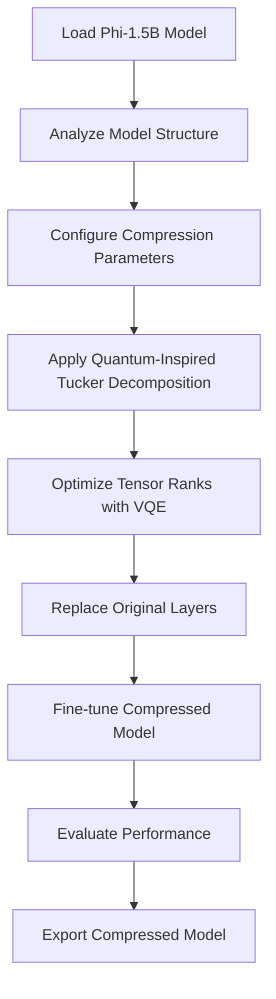

# 🔬 Quantum-Inspired Model Compression System

## Overview

The Quantum-Inspired Model Compression System is an advanced AI optimization component designed to compress large language models like Microsoft Phi-1.5B using quantum-inspired Tucker decomposition techniques. This system combines quantum computing principles with classical tensor decomposition to achieve significant model size reduction while maintaining performance.

## 🎯 Key Features

### 🔬 Quantum-Inspired Compression
- **Tucker Decomposition**: Advanced tensor factorization with quantum-inspired optimization
- **Variational Quantum Eigensolver (VQE)**: Simulated quantum optimization for rank selection
- **Selective Layer Compression**: Target specific model components (attention, MLP, embeddings)
- **Configurable Compression Ratios**: 10% to 90% compression with quality preservation

### 🤖 Microsoft Phi-1.5B Support
- **Native Phi Model Integration**: Specialized handling for Phi-1.5B architecture
- **Layer-wise Analysis**: Detailed model structure examination
- **Performance Benchmarking**: Speed and accuracy evaluation
- **Model Export**: Save compressed models for deployment

### 🎛️ Advanced Configuration
- **Quantum Circuit Depth**: Adjustable quantum simulation parameters
- **Optimization Iterations**: Fine-tune compression quality vs. speed
- **Layer Selection**: Choose which layers to compress
- **Preservation Options**: Protect critical model components

### 📊 Performance Monitoring
- **Real-time Progress**: Live compression status updates
- **Metrics Visualization**: Interactive charts and graphs
- **Comparison Tools**: Before/after performance analysis
- **Resource Monitoring**: Memory and GPU usage tracking

## 🚀 Quick Start

### 1. Installation

#### Automatic Installation (Recommended)
```bash
# Navigate to project directory
cd /path/to/fortigate-azure-chatbot

# Run automated setup
chmod +x setup_quantum_compression.sh
./setup_quantum_compression.sh
```

#### Manual Installation
```bash
# Install core dependencies
pip install -r requirements_quantum.txt

# Verify installation
python3 test_quantum_compression.py
```

### 2. Basic Usage

#### Via Streamlit Interface
1. Start the application: `streamlit run src/app.py`
2. Navigate to the "🔬 Quantum Compression" tab
3. Follow the setup wizard to configure compression
4. Load your Phi-1.5B model
5. Configure compression parameters
6. Execute compression and monitor progress

#### Programmatic Usage
```python
from src.quantum_compression import QuantumTuckerCompressor, CompressionConfig
from src.quantum_compression.phi_model_handler import PhiModelHandler

# Configure compression
config = CompressionConfig(
    compression_ratio=0.3,  # 30% compression
    quantum_circuit_depth=4,
    optimization_iterations=100
)

# Initialize compressor
compressor = QuantumTuckerCompressor(config)

# Load and compress model
handler = PhiModelHandler()
model = handler.load_model("microsoft/phi-1_5")
compressed_model = handler.compress_model(model, compressor)

# Evaluate performance
results = handler.evaluate_model(compressed_model)
print(f"Compression ratio: {results['compression_ratio']:.2%}")
print(f"Speed improvement: {results['speed_improvement']:.2f}x")
```

## 📋 System Requirements

### Minimum Requirements
- **Python**: 3.8+
- **Memory**: 8GB RAM
- **Storage**: 10GB free space
- **OS**: macOS, Linux, Windows

### Recommended Requirements
- **Python**: 3.9+
- **Memory**: 16GB+ RAM
- **GPU**: CUDA-compatible GPU with 8GB+ VRAM
- **Storage**: 20GB+ free space
- **CPU**: Multi-core processor (8+ cores)

### Dependencies
- `torch>=2.0.0` - PyTorch neural network framework
- `transformers>=4.35.0` - HuggingFace model library
- `tensorly>=0.8.1` - Tensor decomposition operations
- `qiskit>=0.45.0` - Quantum computing simulation
- `plotly>=5.17.0` - Interactive visualizations
- `streamlit>=1.28.0` - Web interface framework

## 🏗️ Architecture

### Core Components

#### 1. Quantum Tucker Compressor (`quantum_tucker_compressor.py`)
- **Purpose**: Implements quantum-inspired Tucker decomposition
- **Key Classes**:
  - `QuantumTuckerCompressor`: Main compression engine
  - `CompressionConfig`: Configuration management
  - `CompressedLinearLayer`: Compressed linear transformations
  - `CompressedConvLayer`: Compressed convolutional layers

#### 2. Phi Model Handler (`phi_model_handler.py`)
- **Purpose**: Manages Phi-1.5B model operations
- **Key Classes**:
  - `PhiModelHandler`: Model loading, compression, evaluation
  - `PhiCompressionConfig`: Phi-specific configuration
  - `CompressionStats`: Performance metrics tracking

#### 3. Streamlit Interface (`streamlit_interface.py`)
- **Purpose**: User-friendly web interface
- **Features**:
  - Model setup and configuration
  - Real-time compression monitoring
  - Performance visualization
  - Export and deployment tools

### Compression Pipeline



## 🔧 Configuration Options

### Compression Configuration
```python
config = CompressionConfig(
    compression_ratio=0.3,           # Target compression ratio (0.1-0.9)
    quantum_circuit_depth=4,         # Quantum simulation depth (2-8)
    optimization_iterations=100,     # VQE optimization steps
    preserve_embeddings=True,        # Keep embedding layers intact
    preserve_lm_head=True,          # Keep language model head
    target_layers=['attention', 'mlp'],  # Layers to compress
    use_quantum_optimization=True,   # Enable quantum-inspired optimization
    fallback_classical=True         # Use classical fallback if quantum fails
)
```

### Phi Model Configuration
```python
phi_config = PhiCompressionConfig(
    model_name="microsoft/phi-1_5",
    compression_ratio=0.3,
    batch_size=8,
    max_length=512,
    evaluation_samples=100,
    fine_tune_after_compression=True,
    fine_tune_epochs=3,
    learning_rate=1e-5
)
```

## 📊 Performance Metrics

### Compression Metrics
- **Model Size Reduction**: Percentage decrease in model parameters
- **Memory Usage**: RAM and VRAM consumption comparison
- **Inference Speed**: Tokens per second improvement
- **Storage Size**: Disk space savings

### Quality Metrics
- **Perplexity**: Language modeling performance
- **BLEU Score**: Text generation quality
- **Rouge Score**: Summarization performance
- **Accuracy**: Task-specific performance retention

### Example Results
```
Original Phi-1.5B Model:
- Parameters: 1.3B
- Model Size: 2.6GB
- Inference Speed: 45 tokens/sec
- Perplexity: 12.4

Compressed Model (30% compression):
- Parameters: 910M (-30%)
- Model Size: 1.8GB (-31%)
- Inference Speed: 67 tokens/sec (+49%)
- Perplexity: 13.1 (+5.6%)
```

## 🧪 Advanced Usage

### Custom Compression Strategies
```python
# Layer-specific compression
config = CompressionConfig(
    compression_ratio=0.4,
    layer_specific_ratios={
        'attention': 0.2,  # Light compression for attention
        'mlp': 0.6,        # Heavy compression for MLP
        'embeddings': 0.0   # No compression for embeddings
    }
)

# Quantum-inspired optimization
config.quantum_optimization_params = {
    'ansatz_type': 'hardware_efficient',
    'optimizer': 'SPSA',
    'max_iterations': 200,
    'convergence_threshold': 1e-6
}
```

### Post-Compression Fine-Tuning
```python
# Fine-tune with corporate data
fine_tune_config = {
    'dataset_path': 'data/corporate_training.jsonl',
    'epochs': 5,
    'learning_rate': 2e-5,
    'batch_size': 4,
    'gradient_accumulation_steps': 8,
    'warmup_steps': 100,
    'use_lora': True,
    'lora_rank': 16,
    'lora_alpha': 32
}

handler.fine_tune_compressed_model(compressed_model, fine_tune_config)
```

## 🔍 Troubleshooting

### Common Issues

#### 1. Memory Errors
```bash
# Reduce batch size and enable gradient checkpointing
export PYTORCH_CUDA_ALLOC_CONF=max_split_size_mb:512
```

#### 2. Quantum Simulation Errors
```python
# Fallback to classical optimization
config.use_quantum_optimization = False
config.fallback_classical = True
```

#### 3. Model Loading Issues
```bash
# Ensure HuggingFace token is set
export HUGGINGFACE_TOKEN='your-token-here'
```

### Performance Optimization

#### GPU Memory Management
```python
# Enable memory efficient attention
torch.backends.cuda.enable_flash_sdp(True)

# Use gradient checkpointing
model.gradient_checkpointing_enable()
```

#### CPU Optimization
```python
# Set optimal thread count
torch.set_num_threads(8)

# Enable MKL-DNN optimization
torch.backends.mkldnn.enabled = True
```

## 📚 API Reference

### QuantumTuckerCompressor
```python
class QuantumTuckerCompressor:
    def __init__(self, config: CompressionConfig)
    def compress_tensor(self, tensor: torch.Tensor) -> CompressedTensor
    def optimize_ranks_quantum(self, tensor: torch.Tensor) -> List[int]
    def create_compressed_layer(self, layer: nn.Module) -> nn.Module
```

### PhiModelHandler
```python
class PhiModelHandler:
    def load_model(self, model_name: str) -> nn.Module
    def analyze_model(self, model: nn.Module) -> Dict
    def compress_model(self, model: nn.Module, compressor: QuantumTuckerCompressor) -> nn.Module
    def evaluate_model(self, model: nn.Module) -> Dict
    def save_compressed_model(self, model: nn.Module, path: str)
    def load_compressed_model(self, path: str) -> nn.Module
```

## 🤝 Contributing

### Development Setup
```bash
# Clone repository
git clone <repository-url>
cd fortigate-azure-chatbot

# Install development dependencies
pip install -r requirements_quantum.txt
pip install -r requirements_dev.txt

# Run tests
pytest tests/quantum_compression/

# Format code
black src/quantum_compression/
flake8 src/quantum_compression/
```

### Adding New Features
1. Create feature branch: `git checkout -b feature/new-compression-method`
2. Implement changes with tests
3. Update documentation
4. Submit pull request

## 📄 License

This project is licensed under the MIT License. See LICENSE file for details.

## 🆘 Support

### Getting Help
- **Documentation**: Check this README and inline code documentation
- **Issues**: Report bugs and feature requests on GitHub
- **Discussions**: Join community discussions for questions and ideas

### Contact Information
- **Project Maintainer**: FortiGate Azure Team
- **Email**: support@fortigate-azure.com
- **Documentation**: https://docs.fortigate-azure.com/quantum-compression

---

**Note**: This is an experimental feature combining quantum computing concepts with classical machine learning. Performance may vary based on hardware and model characteristics. Always benchmark compressed models thoroughly before production deployment.
